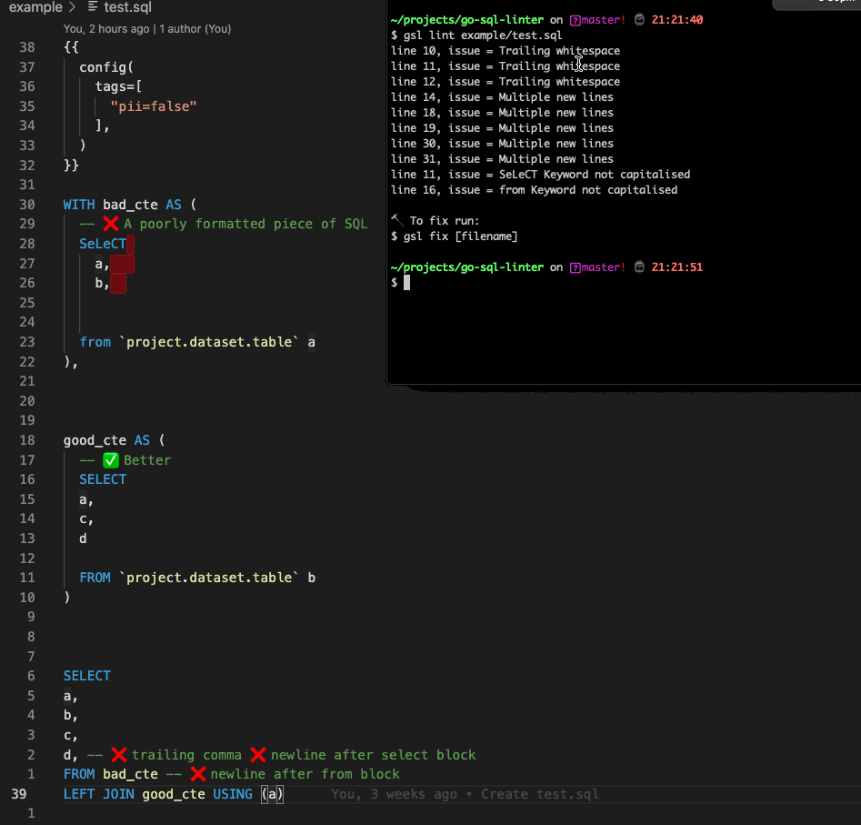

# gsl
> go-sql-linter | good-sql-looks



# Dev
```bash
# build
$ go build -o gsl main.go
# test
$ gsl lint example/test.sql
```

# TODOs
**cmd**
- [x] error if filename not `.sql`
- [x] overwrite previous file
- [] take multiple files could be `gsl file1 file2` or `gsl .` with an `-r` flag for recursive

**lint rules**

- [x] Trailing Whitespace
- [x] Greater than one newline
- [] capitalisation of SQL keywords
- [] detecting nested queries
...
